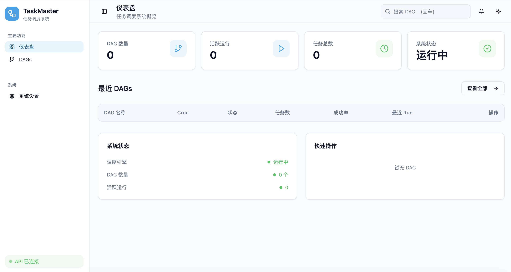

# TaskMaster

[中文文档](README_CN.md)

A high-performance DAG task scheduler built with modern C++23.



## Features

- DAG-based task dependencies
- Cron scheduling with standard expressions
- **XCom (Cross-Communication)** - Pass data between tasks
- Web UI with DAG visualization (React Flow)
- REST API for monitoring and control
- SQLite persistence with crash recovery

## Quick Start

### Build

```bash
cmake -B build -DCMAKE_BUILD_TYPE=Release
cmake --build build -j
```

### Run

```bash
# Start scheduler and API server
./build/bin/taskmaster serve -c system_config.yaml

# Access Web UI at http://localhost:8888
```

### Build Web UI (Optional)

```bash
cd web-ui
npm install && npm run build
```

## CLI Reference

### Commands

#### `serve` - Start TaskMaster service

```bash
taskmaster serve -c system_config.yaml
```

Starts the scheduler and API server. Requires `-c, --config` for system configuration.

#### `run` - Trigger a DAG run

```bash
taskmaster run --db taskmaster.db <dag_id>
```

Checks if DAG exists in database. To actually trigger, use the API endpoint.

#### `list` - List all DAGs

```bash
taskmaster list --db taskmaster.db
```

Lists all DAGs stored in the database.

#### `validate` - Validate DAG files

```bash
taskmaster validate -c system_config.yaml
```

Validates DAG YAML files in the configured directory.

#### `status` - Show DAG run history

```bash
taskmaster status --db taskmaster.db <dag_id>
taskmaster status --db taskmaster.db <dag_id> --run <run_id>
```

Shows run history for a DAG or details of a specific run.

## Project Structure

```
TaskMaster/
├── system_config.yaml    # System configuration
├── dags/                 # DAG definition files
│   ├── simple.yaml       # Simple example DAG
│   ├── monitoring.yaml   # System monitoring DAG
│   ├── xcom_example.yaml # XCom data pipeline example
│   └── docker_example.yaml # Docker executor example
├── build/bin/taskmaster  # Compiled binary
└── web-ui/               # React frontend
```

## System Configuration

The `system_config.yaml` file configures the scheduler, storage, and API:

```yaml
scheduler:
  log_level: info
  tick_interval_ms: 1000
  max_concurrency: 10

storage:
  db_file: taskmaster.db

api:
  enabled: true
  host: 127.0.0.1
  port: 8888

dag_source:
  directory: ./dags
  scan_interval_sec: 60
```

### Config Fields

| Field | Description |
|-------|-------------|
| `scheduler.log_level` | Logging level (debug, info, warn, error) |
| `scheduler.tick_interval_ms` | Scheduler tick interval in milliseconds |
| `scheduler.max_concurrency` | Maximum concurrent task executions |
| `storage.db_file` | SQLite database path |
| `api.enabled` | Enable/disable REST API and Web UI |
| `api.host` | API bind address |
| `api.port` | API port |
| `dag_source.directory` | Directory containing DAG YAML files |
| `dag_source.scan_interval_sec` | Hot-reload interval for DAG changes |

## DAG Configuration

DAG files are placed in the `dags/` directory. **Filename becomes the DAG ID** (e.g., `simple.yaml` → DAG ID: `simple`).

### DAG File Structure

```yaml
name: My DAG Name
description: Optional description
cron: "0 2 * * *"  # Optional: enables auto-scheduling
tasks:
  - id: task1
    name: Task One
    command: echo '{"status": "ok", "count": 42}'
    xcom_push:
      - key: result
        source: json
  - id: task2
    name: Task Two
    command: echo "Received $DATA"
    dependencies: [task1]
    xcom_pull:
      - key: result
        from: task1
        env: DATA
```

### DAG Fields

| Field | Type | Description |
|-------|------|-------------|
| `name` | string | Display name |
| `description` | string | Description (optional) |
| `cron` | string | Cron expression (optional, enables auto-scheduling) |
| `tasks` | array | Task definitions (required) |

**Note:** If `cron` is present, DAG runs automatically on schedule. Without `cron`, DAG is manual-only (trigger via API or CLI).

### Task Fields

| Field | Type | Description |
|-------|------|-------------|
| `id` | string | Unique task identifier (required) |
| `name` | string | Display name (optional) |
| `command` | string | Shell command to execute (required) |
| `executor` | string | Executor type: `shell` (default) or `docker` |
| `docker_image` | string | Docker image (required when executor is `docker`) |
| `docker_socket` | string | Docker socket path (default: `/var/run/docker.sock`) |
| `dependencies` | array | List of task IDs this task depends on |
| `timeout` | int | Timeout in seconds (default: 300) |
| `max_retries` | int | Max retries on failure (default: 3) |
| `retry_interval` | int | Seconds to wait between retries (default: 60) |
| `xcom_push` | array | XCom values to extract from task output |
| `xcom_pull` | array | XCom values to inject as environment variables |

### Example DAGs

See the `dags/` directory for examples:

- **simple.yaml** - Basic two-task DAG that runs every minute
- **monitoring.yaml** - System health checks (disk, API, database) with metrics collection
- **xcom_example.yaml** - Data pipeline demonstrating XCom for passing data between tasks
- **docker_example.yaml** - Docker executor demo with mixed shell/container tasks

## XCom (Cross-Communication)

XCom enables data passing between tasks in a DAG. Common use cases:

- **ETL pipelines**: Pass record counts, file paths, or batch IDs between extract/transform/load stages
- **Dynamic workflows**: Let upstream tasks determine parameters for downstream tasks
- **Result aggregation**: Collect outputs from multiple tasks for a final summary

Producer tasks push values extracted from their output; consumer tasks pull them as environment variables.

### Push Configuration (`xcom_push`)

Extract values from task output:

```yaml
xcom_push:
  - key: result           # Key name for this value
    source: stdout        # stdout, stderr, exit_code, or json
    json_path: data.id    # Optional: extract from JSON (e.g., "items[0].name")
    regex: "ID: (\\d+)"   # Optional: extract via regex
    regex_group: 1        # Which capture group (default: 0)
```

| Source | Description |
|--------|-------------|
| `stdout` | Capture stdout as string (default) |
| `stderr` | Capture stderr as string |
| `exit_code` | Capture exit code as integer |
| `json` | Parse stdout as JSON |

### Pull Configuration (`xcom_pull`)

Inject values as environment variables:

```yaml
xcom_pull:
  - key: result           # Key to retrieve
    from: producer_task   # Source task ID
    env: MY_DATA          # Environment variable name
```

### Example

```yaml
tasks:
  - id: producer
    command: echo '{"count": 42}'
    xcom_push:
      - key: data
        source: json

  - id: consumer
    command: echo "Received $COUNT items"
    dependencies: [producer]
    xcom_pull:
      - key: data
        from: producer
        env: COUNT
```

## REST API

| Method | Endpoint | Description |
|--------|----------|-------------|
| GET | `/api/health` | Health check |
| GET | `/api/status` | System status (DAG count, active runs) |
| GET | `/api/dags` | List all DAGs |
| GET | `/api/dags/:id` | Get DAG details |
| GET | `/api/dags/:id/tasks/:taskId` | Get task details |
| POST | `/api/dags/:id/trigger` | Trigger DAG run |
| GET | `/api/history` | List run history |
| GET | `/api/runs/:runId/tasks/:taskId/logs` | Get task logs |

## Requirements

- C++23 (GCC 13+ / Clang 17+)
- CMake 3.25+
- Linux with io_uring

## License

MIT
