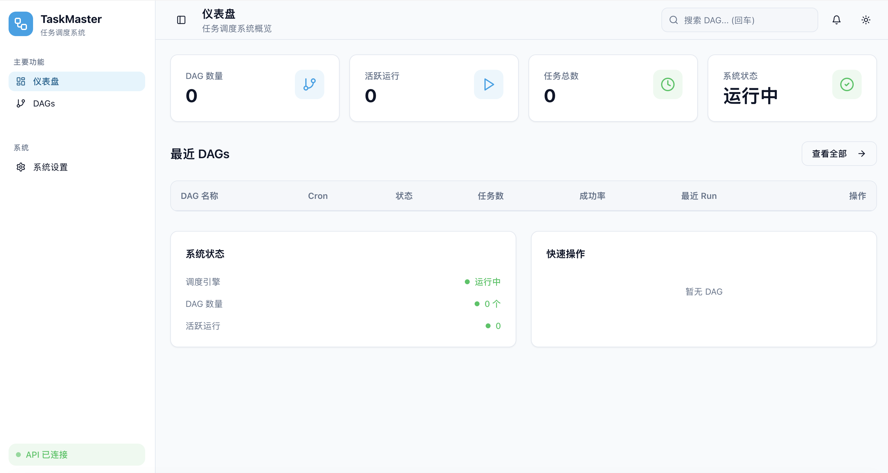

# DAGForge

<div align="center">

**High-performance, low-latency DAG orchestration engine built with modern C++23.**

[](https://en.cppreference.com/w/cpp/23)
[](LICENSE)
[](https://deepwiki.com/CHAK-MING/DAGForge)
[](https://github.com/CHAK-MING/dagforge/releases)

[English](README.md) | [简体中文](README_CN.md)

---

[](#)

</div>

---

## ⚡ What is DAGForge?

**DAGForge** is a sharded, asynchronous workflow engine designed for high-throughput, low-latency task scheduling. Inspired by the **Seastar** architectural model and built on **C++23 coroutines**, it aims to minimize lock contention and maximize core utilization for modern multi-core systems.

Whether you're managing complex data pipelines, orchestrating microservices, or building automated CI/CD workflows, DAGForge provides the speed and reliability needed for high-frequency operations.

---

## ✨ Key Features

- **🚀 Sharded Async Runtime:** Inspired by **Seastar**, utilizing core-local `io_context` (Boost.Asio) to eliminate cross-core lock contention and maximize multi-core throughput.
- **🛠️ Declarative Pipelines:** Express complex logic via clean **TOML** definitions with native support for task dependencies, conditional branching, and polling sensors.
- **🔌 Pluggable Executors:** Orchestrate diverse workloads with first-class support for **Shell**, **Docker**, and **Sensor** execution modes in isolated environments.
- **📡 Interactive Control Plane:** A high-fidelity **React 19** dashboard powered by **React Flow** for dynamic DAG exploration and **WebSockets** for sub-second, live log telemetry.
- **📊 Cloud-Native Observability:** Native **Prometheus** metrics, rich REST APIs, and structured JSON logging designed for seamless integration with modern monitoring stacks.

---

## 📈 Performance Snapshot

DAGForge is built for speed. In the latest NUMA-local 5-run benchmark sweep, it keeps p95 scheduling lag in the low single-digit milliseconds while sustaining throughput around 7,200 tasks/s in burst-ready workloads.

| Scenario | Topology | Total Tasks | Mean Total Lag | p95 Lag | Throughput | vs Airflow 2.0 |
| --- | --- | ---: | ---: | ---: | ---: | ---: |
| `scene1_linear` | 100 DAGs × 10 linear tasks | 1,000 | 0.660 s | 5.40 ms | **4,872 tasks/s** | **~17.6x faster** |
| `scene2_linear` | 10 DAGs × 100 linear tasks | 1,000 | 0.231 s | 1.00 ms | **6,933 tasks/s** | **~62.0x faster** |
| `scene6_burst` | 1 DAG × 1,001 burst-ready tasks | 1,001 | 1.608 s | 1.60 ms | **7,215 tasks/s** | **N/A** |

> [!TIP]
> **Check out the [Benchmark Report](docs/BENCH_REPORT.md)** for a detailed analysis and comparison with other workflow engines.

---

## 🚀 Quickstart

### 1) Prerequisites
- **Linux** (x86-64 or ARM64)
  - Published Linux archives are currently built and smoke-tested on Ubuntu
    26.04 LTS. See the packaged `BUILD-INFO` and `RUNTIME-DEPENDENCIES` files
    for the exact toolchain and shared-library contract.
- **MySQL 8.0+** or **MariaDB 11+**
- **GCC 15+** and **build2 0.17+** (required for building from source)

> [!NOTE]
> DAGForge currently ships a **build2-only** source build. There is no supported
> `CMakeLists.txt`/CMake workflow in this repository.

### 2) Download & Run
The fastest way to get started is by using our **[Release Package](https://github.com/CHAK-MING/dagforge/releases)**.

```bash
# 1. Download & Extract
curl -LO https://github.com/CHAK-MING/dagforge/releases/download/0.3.0/dagforge-0.3.0-linux-x86_64.tar.gz
tar -xzf dagforge-0.3.0-linux-x86_64.tar.gz && cd dagforge-0.3.0-linux-x86_64

# 2. Init DB (ensure MySQL is running)
./bin/dagforge db init

# 3. Start the service
./bin/dagforge serve start --shards 4
```

Visit **[http://localhost:8888](http://localhost:8888)** to view your dashboard.

### 3) Alternative: Build From Source (build2)
```bash
# Bootstrap a stable build2 config under ~/.local/share/build2-configs
./scripts/setup-build2.sh
# Build and update
./scripts/build.sh
# Start the service
./bin/dagforge serve start -c system_config.toml
```

For VS Code and clangd, generate the dedicated Clang PCM graph and compilation
database with `scripts/setup-clangd.sh`. See
[`docs/CLANGD_SETUP.md`](docs/CLANGD_SETUP.md).

### 4) Alternative: Docker Compose
```bash
docker compose up -d
```

---

## 📚 Documentation

Detailed guides and references are available in the **[`docs/`](docs/)** directory:

- **[Getting Started Guide](docs/USER_GUIDE.md#1-first-time-setup)** - Step-by-step setup and configuration.
- **[Core Features Guide](docs/USER_GUIDE.md#5-trigger-rules--when-to-use-each)** - Trigger rules, Sensors, and Docker tasks.
- **[API Reference](docs/API.md)** - Explore our REST and WebSocket endpoints.
- **[CLI Cheatsheet](docs/USER_GUIDE.md#16-cli-cheatsheet)** - Master the `dagforge` command-line tool.

---

## 🗺️ Roadmap

- [x] **OpenTelemetry:** Deep tracing and observability integration.
- [ ] **API Security:** Role-based access control (RBAC) and authentication.
- [ ] **PostgreSQL Support:** Native support for Postgres as a backend store.
- [ ] **Kubernetes Executor:** Scalable task execution in K8s clusters.
- [ ] **Coroutine Optimization:** Further latency reductions in the C++23 runtime.

---

## 🤝 Contributing

We love contributions! Whether it's a bug report, a feature request, or a documentation fix, we value your input.

1. Fork the repo.
2. Create your feature branch (`git checkout -b feature/amazing-feature`).
3. Commit your changes (`git commit -m 'Add amazing feature'`).
4. Push to the branch (`git push origin feature/amazing-feature`).
5. Open a Pull Request.

Check out our **[Official Roadmap](#-roadmap)** for high-priority items.

---

## 📄 License

Distributed under the **Apache License 2.0**. See `LICENSE` for more information.

---

<div align="center">
  Built with ❤️ by the DAGForge Team
</div>
