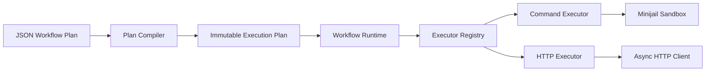

# DAGForge

<div align="center">

**A predictable runtime for JSON-defined DAG workflows.**

[](https://en.cppreference.com/w/cpp/23)
[](LICENSE)
[](https://github.com/CHAK-MING/dagforge/releases)
[](https://deepwiki.com/CHAK-MING/DAGForge)

[English](README.md) · [简体中文](README_CN.md)

</div>

> DAGForge does one job: turn a validated workflow plan into a controlled,
> observable execution.

Your application decides **what** should happen. DAGForge keeps graph
validation, scheduling, retries, cancellation, outputs, and runtime state from
drifting into separate conventions.

It is a workflow runtime, not an agent framework. Planning, model calls, and
business logic stay above it instead of leaking into the scheduler.

## Run it

First build DAGForge and install the pinned Minijail helper:

```bash
./scripts/setup-build2.sh
./scripts/install-minijail.sh
./scripts/build.sh
```

Then validate and run the included workflow:

```bash
dagforge validate --file dags/hello_world.json

dagforge run \
  --config system_config.toml \
  --file dags/hello_world.json \
  --wait
```

Run it as a service when another application needs to submit and control
workflows over HTTP:

```bash
dagforge serve --config system_config.toml
```

Prerequisites and the full setup live in the [User Guide](docs/USER_GUIDE.md).

## A workflow is just JSON

```json
{
  "workflow_id": "hello-world",
  "schema_version": 1,
  "nodes": [
    {
      "id": "hello",
      "executor": "command",
      "outputs": ["result"],
      "config": {
        "program": "/bin/echo",
        "arguments": ["hello from DAGForge"],
        "env": [],
        "input_env": []
      }
    }
  ]
}
```

The plan describes the graph and the task contract. Before anything runs,
DAGForge rejects invalid dependencies, cycles, undeclared ports, unknown
fields, and executor config that does not satisfy server policy.

More examples are in [`dags/`](dags/).

## What makes it different

### One runtime model

A workflow is not a bag of callbacks. Runs, Tasks, and Attempts have distinct
lifecycle states, so retry, timeout, pause, fail-fast, cancellation, and
shutdown all return to one runtime model.

### Executors stay outside the scheduler

The Workflow Runtime dispatches every task through `ITaskExecutor`. The built-in
`command` and `http` executors share the same scheduling contract, while their
process and network details stay outside the Workflow state machine.

### Authority stays with the server

Workflow JSON describes intent. The server owns authority.

| The workflow owns | The server owns |
| --- | --- |
| nodes, dependencies, bindings, outputs | enabled executors |
| task-specific configuration | program registry and environment policy |
| retry and timeout intent | network origins, CIDRs, TLS, resource ceilings |

That means a submitted plan cannot expand host or network access just by
changing its own JSON.

## Architecture


```mermaid
flowchart LR
    Plan[JSON Workflow Plan] --> Compiler[Plan Compiler]
    Compiler --> Execution[Immutable Execution Plan]
    Execution --> Runtime[Workflow Runtime]
    Runtime --> Registry[Executor Registry]
    Registry --> Command[Command Executor]
    Registry --> HTTP[HTTP Executor]
    Command --> Sandbox[Minijail Sandbox]
    HTTP --> Client[Async HTTP Client]
```

The compiler keeps the graph honest. The runtime owns scheduling and lifecycle
state. Executors handle the mechanics of completing one task.

## Go deeper

- [User Guide](docs/USER_GUIDE.md) — workflow plans, runtime behavior, and configuration
- [API Reference](docs/API.md) — HTTP control-plane endpoints
- [North-Star Workflow](docs/NORTH_STAR_WORKFLOW.md) — target fan-out, model, repair, and routing scenario
- [0.4 Development Status](docs/0.4_DEVELOPMENT_STATUS.md) — completed capabilities, evidence, and next milestones
- [System Configuration](system_config.toml) — complete configuration example
- [State Machine ADR](docs/adr/0001-run-task-attempt-state-machine.md) — Run, Task, and Attempt semantics

## For contributors

```bash
# Unit and integration tests
~/.local/share/build2-configs/dagforge-gcc/dagforge/bin/all-unit-tests

# Real JSON workflows through the service, executors, and sandbox
python3 scripts/test-real-workflows.py \
  --binary "$HOME/.local/share/build2-configs/dagforge-gcc/dagforge/bin/dagforge"
```

## License

Apache License 2.0. See [`LICENSE`](LICENSE).
