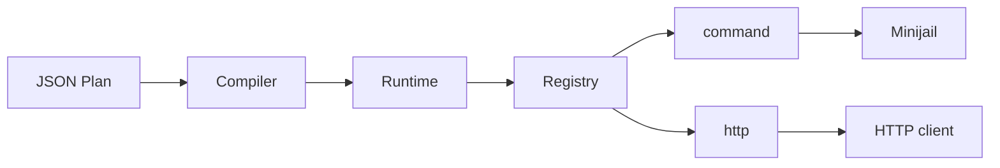

# DAGForge

<div align="center">

**A runtime that executes JSON-defined DAGs.**

[](https://en.cppreference.com/w/cpp/23)
[](LICENSE)
[](https://github.com/CHAK-MING/dagforge/releases)
[](https://deepwiki.com/CHAK-MING/DAGForge)

[English](README.md) · [简体中文](README_CN.md)

</div>

DAGForge reads a workflow described in JSON and runs it as a controlled execution. Graph validation, scheduling, retries, cancellation, and crash recovery are its job; your code only decides what to do.

It is a workflow runtime. Planning, model calls, and business logic stay above it; the scheduling core only executes.

## Run it

```bash
./scripts/setup-build2.sh
./scripts/install-minijail.sh
./scripts/build.sh
```

Validate and run the bundled workflow:

```bash
dagforge validate dags/hello_world.json
dagforge run dags/hello_world.json
```

Start in service mode so other applications can submit and control workflows over HTTP:

```bash
dagforge serve
```

See the [user guide](docs/USER_GUIDE.md) for prerequisites.

## A workflow is just JSON

```json
{
  "workflow_id": "hello-world",
  "schema_version": 1,
  "nodes": [
    {
      "id": "hello",
      "executor": "command",
      "outputs": ["result"],
      "config": {
        "program": "/bin/echo",
        "arguments": ["hello from DAGForge"]
      }
    }
  ]
}
```

Before execution, DAGForge validates the graph: it rejects cycles, undeclared ports, unknown fields, and budget overruns. Nodes pass values through port bindings; conditional routing, fan-out, and fan-in are all expressed in JSON. More examples in [`dags/`](dags/).

## Architecture


```mermaid
flowchart LR
  Plan[JSON Plan] --> Compiler[Compiler]
  Compiler --> Runtime[Runtime]
  Runtime --> Registry[Registry]
  Registry --> Command[command]
  Registry --> HTTP[http]
  Command --> Sandbox[Minijail]
  HTTP --> Client[HTTP client]
```

The compiler guarantees the graph is correct, the runtime owns scheduling and lifecycle, and the executor completes a single task. Process and network details stay out of the scheduling state machine.

## What it handles

- Run / Task / Attempt: three lifecycle layers. Retries, timeouts, pause, and cancellation return to one semantics — no separate implementations.
- After a crash, completed nodes are not re-run. Failures are classified by cause; permanent errors terminate directly.
- The `command` executor runs under Minijail isolation.
- The workflow JSON only describes intent. Executor allowlists, network and resource limits are decided by the server — editing the JSON cannot expand privileges.

## Learn more

[User Guide](docs/USER_GUIDE.md) · [API Reference](docs/API.md) · [North-Star Workflow](docs/NORTH_STAR_WORKFLOW.md) · [0.4 Status](docs/0.4_DEVELOPMENT_STATUS.md) · [State Machine ADR](docs/adr/0001-run-task-attempt-state-machine.md)

## Developers

```bash
# Fast local verification: module smoke, unit, and component tests
bash scripts/test.sh quick

# Full verification: quick, Minijail integration, CLI, and real workflows
bash scripts/test.sh all
```

Apache License 2.0. See [`LICENSE`](LICENSE).
