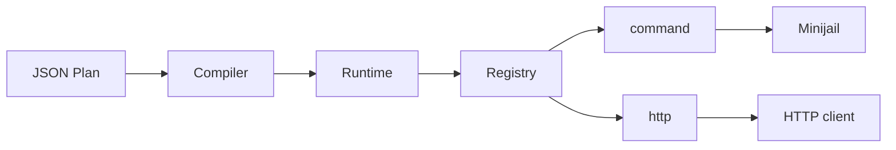

# DAGForge

<div align="center">

**一个执行 JSON 定义 DAG 的运行时。**

[](https://en.cppreference.com/w/cpp/23)
[](LICENSE)
[](https://github.com/CHAK-MING/dagforge/releases)
[](https://deepwiki.com/CHAK-MING/DAGForge)

[English](README.md) · [简体中文](README_CN.md)

</div>

DAGForge 读一份 JSON 描述的工作流，把它跑成一次受控的执行。图的校验、调度、重试、取消、崩溃恢复都归它管；你的代码只决定要做什么。

它是一个工作流运行时。规划、模型调用和业务逻辑留在上层，调度核心只管执行。

## 跑起来

```bash
./scripts/setup-build2.sh
./scripts/install-minijail.sh
./scripts/build.sh
```

校验并运行自带的工作流：

```bash
dagforge validate dags/hello_world.json
dagforge run dags/hello_world.json
```

以服务模式启动，供其他应用通过 HTTP 提交和控制：

```bash
dagforge serve
```

环境要求见[用户指南](docs/USER_GUIDE.md)。

## 工作流就是 JSON

```json
{
  "workflow_id": "hello-world",
  "schema_version": 1,
  "nodes": [
    {
      "id": "hello",
      "executor": "command",
      "outputs": ["result"],
      "config": {
        "program": "/bin/echo",
        "arguments": ["hello from DAGForge"]
      }
    }
  ]
}
```

执行前，DAGForge 先校验图：拒绝循环、未声明的端口、未知字段、超预算。节点之间用端口绑定传值；条件路由、并发、聚合都在 JSON 里写完。更多例子见 [`dags/`](dags/)。

## 架构



编译器保证图正确，运行时负责调度和生命周期，执行器把单个任务做完。进程和网络细节留在调度状态机之外。

## 它管什么

- Run / Task / Attempt 三层生命周期。重试、超时、暂停、取消回到同一套语义，无需各自实现。
- 崩溃后已完成的节点不重跑。失败按原因分类，永久错误直接终止。
- `command` 执行器走 Minijail 隔离运行。
- 工作流 JSON 只描述意图。执行器白名单、网络与资源上限由服务端决定，改 JSON 扩不了权。

## 继续了解

[用户指南](docs/USER_GUIDE.md) · [API 参考](docs/API.md) · [North-Star 场景](docs/NORTH_STAR_WORKFLOW.md) · [0.4 状态](docs/0.4_DEVELOPMENT_STATUS.md) · [状态机 ADR](docs/adr/0001-run-task-attempt-state-machine.md)

## 开发者

```bash
# 快速本地验证：module smoke、unit 与 component tests
bash scripts/test.sh quick

# 完整验证：quick、Minijail integration、CLI 与真实 workflow
bash scripts/test.sh all
```

Apache License 2.0，详见 [`LICENSE`](LICENSE)。
