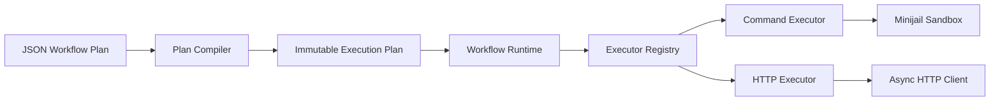

# DAGForge

<div align="center">

**一个用于执行 JSON DAG Workflow 的可预测运行时。**

[](https://en.cppreference.com/w/cpp/23)
[](LICENSE)
[](https://github.com/CHAK-MING/dagforge/releases)
[](https://deepwiki.com/CHAK-MING/DAGForge)

[English](README.md) · [简体中文](README_CN.md)

</div>

> DAGForge 只做一件事：把通过校验的 Workflow Plan，变成一次受控、可观测的执行。

上层应用决定**要做什么**；DAGForge 把图校验、调度、重试、取消、输出和运行
状态这些容易失控的部分统一管起来。

它是 Workflow Runtime，不是 Agent 框架。规划、模型调用和业务逻辑留在上层，
不进入调度器核心。

## 先跑起来

先构建 DAGForge，并安装固定版本的 Minijail Helper：

```bash
./scripts/setup-build2.sh
./scripts/install-minijail.sh
./scripts/build.sh
```

然后校验并运行仓库自带的 Workflow：

```bash
dagforge validate --file dags/hello_world.json

dagforge run \
  --config system_config.toml \
  --file dags/hello_world.json \
  --wait
```

当其他应用需要通过 HTTP 提交和控制 Workflow 时，启动服务模式：

```bash
dagforge serve --config system_config.toml
```

环境要求和完整安装说明放在[用户指南](docs/USER_GUIDE.md)。

## Workflow 就是 JSON

```json
{
  "workflow_id": "hello-world",
  "schema_version": 1,
  "nodes": [
    {
      "id": "hello",
      "executor": "command",
      "outputs": ["result"],
      "config": {
        "program": "/bin/echo",
        "arguments": ["hello from DAGForge"],
        "env": [],
        "input_env": []
      }
    }
  ]
}
```

Plan 描述图结构和 Task 契约。在真正执行之前，DAGForge 会先拒绝非法依赖、环、
未声明端口、未知字段，以及不满足服务端策略的执行器配置。

更多例子直接看 [`dags/`](dags/)。

## 它为什么不一样

### 一套运行模型

Workflow 不是一组回调。Run、Task 和 Attempt 各自拥有明确生命周期，因此重试、
超时、暂停、Fail-fast、取消和关闭都能回到同一套运行模型。

### 执行器留在调度器之外

Workflow Runtime 统一通过 `ITaskExecutor` 派发任务。内置 `command` 和 `http`
执行器共享同一套调度契约，而进程与网络细节留在 Workflow 状态机之外。

### 权限始终属于服务端

Workflow JSON 描述意图，权限归服务端所有。

| Workflow 决定 | 服务端决定 |
| --- | --- |
| 节点、依赖、绑定和输出 | 启用哪些执行器 |
| Task 专属配置 | 程序注册表与环境变量策略 |
| 重试和超时意图 | 网络 Origin、CIDR、TLS 和资源上限 |

因此，提交者不能只靠改一段 JSON，就扩大宿主机或网络访问权限。

## 架构



Compiler 保证图是正确的，Runtime 负责调度和生命周期状态，Executor 负责把一个
具体 Task 做完。

## 继续了解

- [用户指南](docs/USER_GUIDE.md) — Workflow Plan、运行语义和系统配置
- [API 参考](docs/API.md) — HTTP 控制面接口
- [North-Star Workflow](docs/NORTH_STAR_WORKFLOW.md) — 目标 fan-out、模型、修复和条件路由场景
- [0.4 开发状态](docs/0.4_DEVELOPMENT_STATUS.md) — 已完成能力、验证证据和后续里程碑
- [系统配置](system_config.toml) — 完整配置示例
- [状态机 ADR](docs/adr/0001-run-task-attempt-state-machine.md) — Run、Task 和 Attempt 语义

## 开发者

```bash
# 单元测试与集成测试
~/.local/share/build2-configs/dagforge-gcc/dagforge/bin/all-unit-tests

# 通过真实服务、执行器和沙箱运行 JSON Workflow
python3 scripts/test-real-workflows.py \
  --binary "$HOME/.local/share/build2-configs/dagforge-gcc/dagforge/bin/dagforge"
```

## 开源协议

Apache License 2.0。详见 [`LICENSE`](LICENSE)。
