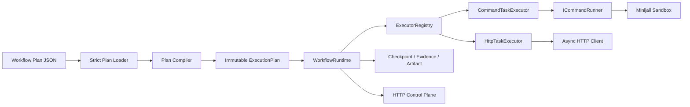

# DAGForge 0.4 开发状态与后续计划

更新日期：2026-07-15

本文用于说明 DAGForge 0.4 当前已经形成的产品能力、可复现示例、质量证据、
已知边界，以及进入 Release Candidate 前建议继续开发的内容。

当前源码与质量基线由以下提交建立：

- `8f392d20 refactor(core): align 0.4 runtime boundaries`
- `02d927ed test(quality): enforce coverage and benchmarks`

## 1. 当前结论

DAGForge 0.4 已经具备一个可独立运行的 JSON DAG execution kernel：

- Workflow Plan 使用严格 JSON，并在执行前完成图、端口、预算和 executor
  配置校验；
- Runtime 使用明确的 Run、Task、Attempt 状态机处理调度、重试、暂停、
  取消、fail-fast 和 shutdown；
- Workflow 只依赖统一的 `ITaskExecutor` seam，不包含 Command、HTTP、
  sandbox 或 transport 细节；
- 内置 Command executor 通过 Minijail sandbox 执行已授权程序；
- 内置 HTTP executor 使用 server-owned origin、CIDR、TLS、容量和 timeout
  策略；
- Plan catalog、Run checkpoint、Evidence、Artifact 和 completed Run 支持可选
  文件持久化；
- 非终态 Run 可在进程重启后继续执行；中断 Attempt 被明确关闭，未完成 Task
  创建新 Attempt，成功分支及其输出不会重跑；
- 失败 Run 可基于修订后的完整 JSON Plan 创建带 lineage 的 Repair Run，并
  保守复用不受影响的成功节点；
- Run failure-report 统一返回 Run、Task、Attempt failure 和诊断 Artifact；
- CLI 和 HTTP control plane 可以验证、提交、查询、暂停、恢复和取消 Run；
- 已建立普通测试、真实 Workflow、coverage、sanitizer、module graph、
  repository convention 和 benchmark 验证链。

0.4 当前更接近“单机、可控、可恢复的 Workflow Runtime”，而不是 0.3 的
调度器、数据库、Web UI 和多 executor 集合的延续。这是有意的产品收敛。

## 2. 当前架构



所有权边界如下：

| 模块 | 负责 | 不负责 |
| --- | --- | --- |
| `workflow` | Plan、状态机、调度、重试、输出契约 | HTTP、进程、sandbox policy |
| `executors/command` | Command JSON、input 映射、Workflow outputs | Minijail 进程监督细节 |
| `sandbox` | 已规范化命令的隔离、资源限制、kill/reap | Workflow Plan 和端口 |
| `executors/http` | HTTP Task schema、egress policy、Attempt 生命周期 | 通用 socket/parser 实现 |
| `http` | DNS/TCP/TLS/HTTP transport、server、router | Workflow value 和 Task state |
| `app` | 配置读取、组件组装、executor 注册、shutdown 顺序 | executor 内部策略 |

这个边界允许后续增加 executor，而不需要修改 Workflow 状态机，也不需要给
`Application` 增加 executor-specific shutdown 分支。

## 3. 已完成的核心能力

### 3.1 Workflow contract

- `schema_version: 1` 的严格 JSON Plan；
- 编译期检测 cycle、重复 node、非法 dependency、未声明输入和输出；
- executor-owned config compilation；
- immutable `ExecutionPlan`、稳定 Plan digest 和显式 `plan_id`；
- linear、fan-out/fan-in 和条件边；
- workflow output publication contract；
- plan budget 和 executor allowlist admission policy。

### 3.2 Runtime lifecycle

- Run：`running`、`pausing`、`paused`、`stopping`、`succeeded`、`failed`、
  `cancelled`；
- Task：`pending`、`ready`、`running`、`retry_waiting`、`succeeded`、
  `failed`、`skipped`、`cancelled`；
- 每次执行产生独立 Attempt history；
- saturated exponential retry + full jitter；重试资格只从
  `ExecutionFailure.kind` 推导，不持久化第二份 failure classification；
- `continue_independent` 和 `fail_fast`；
- pause 停止新 dispatch，但不冻结正在运行的外部进程；
- cancel 先进入 `stopping`，等待所有 executor completion 收敛后进入终态；
- 同一个非空 idempotency key 在 checkpoint 保留期间返回原 Run ID，并在重启后
  恢复；只有 Workflow、Plan 和 repair parent 身份一致时才视为同一请求，冲突
  key 会 fail closed。

### 3.3 Command sandbox

- slash-free program 只通过管理员配置的 exact program registry 解析；
- 不执行 PATH lookup；
- absolute path 仍需 canonical trusted-file validation 和授权；
- user、PID、mount、network、IPC、UTS 和 cgroup namespace；
- Landlock、seccomp、private tmpfs 和 resource limits；
- private owner-only Attempt workdir；
- server-owned minimal environment；
- stdout、stderr、line 和 total-output limit；
- output overflow、timeout、cancel 和 shutdown 均 kill/reap 完整 process group；
- Command Workflow 不提供打开外部网络的开关。

### 3.4 HTTP execution boundary

- strict HTTP node JSON；
- exact canonical origin allowlist；
- DNS 解析后再次按 IP/CIDR policy 授权；
- private/special-use address 默认拒绝，显式 CIDR exception 可放行；
- TLS hostname verification、minimum TLS version、custom CA 和可选 mTLS；
- DNS、connect、TLS、write、first-byte 和 read 独立 timeout；
- per-shard 与 process-wide active request ceiling；
- bounded keep-alive pool；
- cancellation 可中断全部 transport stage；
- 输出稳定为 `status`、`body`、`headers` 和 `result`；
- 401/403 等 permanent failure 不重试，5xx/429/timeout 等 retryable failure
  进入 Runtime retry policy。

### 3.5 Persistence, recovery, and control plane

- independent file-backed immutable Plan catalog；
- file-backed Run checkpoints；
- append-only Evidence ledger；
- bounded Artifact storage、large-output promotion 和 oversized failure-detail
  promotion；
- accepted Run 在返回 ID 前写入 initial checkpoint；
- Plan、checkpoint、Evidence rewrite 和 Artifact 使用统一 durable-file
  primitive：临时文件写满并 `fsync`、原子 rename、父目录 `fsync`；Evidence
  append 同步记录，Artifact bytes 在 metadata 前提交；
- checkpoint 重新校验 Plan digest、output budget、published outputs、Task 输出
  所有权和 Artifact 完整性；
- Task 多输出写入失败会回滚同一 completion 已写入的正常输出；
- completed 与 non-terminal Run startup recovery；
- restart 时无法重新连接的 active Attempt 被标记为 `runtime_restarted`，对应
  Task 重新进入 ready 并创建新 Attempt；
- paused、retry-waiting、stopping、deadline 和 retained idempotency semantics；
- immutable child Repair Run、parent lineage、Task reuse provenance 和 transitive
  invalidation；
- Plan、Run、output、Evidence、failure report、repair、Artifact、pause、resume 和
  cancel HTTP interfaces；
- 控制面错误与执行错误统一为 `kind/code/message/details/artifacts`，不再要求
  AI 解析字符串；
- Bearer authentication、body limits、request capacity 和 TLS-only listener。

目标多 executor 场景已经记录在
[`NORTH_STAR_WORKFLOW.md`](NORTH_STAR_WORKFLOW.md)。本阶段没有设计 Model、WASM
或 MCP executor；恢复层仍只依赖 `ITaskExecutor`、Workflow values 和
`ExecutionFailure`。

## 4. 可以直接验证的例子

### 4.1 单节点 Command Workflow

```bash
dagforge validate dags/hello_world.json

dagforge run \
  dags/hello_world.json
```

这个例子验证 Plan compilation、Command executor 注册、program policy、
Minijail launch、Attempt completion 和 Workflow output publication。

### 4.2 条件边

`dags/conditional.json` 的 `decide` 节点输出 `go`。两个下游边分别要求
`go` 和 `stop`：

```json
{
  "source_node": "decide",
  "source_port": "result",
  "target": "selected",
  "condition": {
    "kind": "string_equals",
    "expected_string": "go"
  }
}
```

真实 Workflow suite 验证：

- Run 为 `succeeded`；
- `selected` 为 `succeeded`；
- `rejected` 为 `skipped`；
- published output 为 `selected`。

### 4.3 Command → HTTP → Command data flow

`dags/http_pipeline.json` 执行以下数据流：

```text
produce.result = "hello"
token.result   = "secret"
        │
        ▼
HTTP POST /transform
body     <- produce.result
X-Token  <- token.result
        │
        ▼
request.result = "http:hello|token:secret"
        │
        ▼
publish.result = "published:http:hello|token:secret"
```

这个例子同时覆盖 input binding、input-derived header/body、HTTP accepted
status、keep-alive transport、downstream environment mapping 和 published
Workflow output。

完整无人值守验证：

```bash
python3 scripts/test-real-workflows.py \
  --binary "$HOME/.local/share/build2-configs/dagforge-gcc/dagforge/bin/dagforge"
```

### 4.4 Retry and Attempt history

`dags/retry_failure.json` 设置 `max_retries: 2`，命令持续返回 retryable
failure。Runtime 使用 saturated exponential cap 与 full jitter。真实 Workflow
suite 验证最终状态为 `failed`，并保留 3 个 Attempt：
首次执行加两次 retry。

这个例子用于确认 retry policy 不只是重新调用 executor，而是完整记录每个
Attempt 的状态、错误、时间和终止原因。

## 5. 质量与性能证据

### 5.1 Verification matrix

| 检查 | 结果 |
| --- | --- |
| GCC normal build | 通过 |
| Unit/integration tests | 245 / 245 通过 |
| Module smoke | 通过 |
| Clang ASan + UBSan | 245 / 245 通过，零报告 |
| Module graph | 11 modules，通过 |
| Repository conventions | 通过 |
| `git diff --check` | 通过 |
| OpenSpec strict validation | 通过 |

GCC 15 在 C++ modules 与 ASan/UBSan 同时启用时触发 GCC 内部编译器错误，
因此 sanitizer matrix 使用 Clang 完成；普通 GCC modules build 已独立通过。

### 5.2 Coverage

生产 `.cpp` coverage：

| 类型 | 覆盖率 |
| --- | ---: |
| Source lines | 90.07% |
| Functions | 96.89% |
| Branches | 76.26% |

Coverage gate 运行 unit/integration tests 和真实 Workflow suite。第三方代码、
测试、generated module artifacts 和 module interface units 不进入生产源码
分母。

当前 line coverage 只刚好越过 90% 门槛。下一阶段应增加余量，重点是：

- `workflow_runtime.cpp`：87.57%；
- `http_client.cpp`：85.69%；
- `http_server.cpp`：87.04%；
- `minijail_command_runner.cpp`：86.73%；
- `main.cpp`：80.17%。

### 5.3 Representative benchmark results

审核环境使用 GCC 15、`-O3 -DNDEBUG -march=native`、7 次随机交错、固定在
一个 NUMA node。代表性结果如下：

| 场景 | Median | CV |
| --- | ---: | ---: |
| Workflow linear, 32 nodes | 781.96 µs | 3.20% |
| Workflow fan-out, 128 nodes | 2.92 ms | 3.02% |
| Checkpoint every node, 128 nodes | 10.85 ms | 3.33% |
| HTTP keep-alive, 64-byte body | 85.81 µs | 9.02% |
| HTTP reconnect, 64-byte body | 189.99 µs | 5.90% |
| File checkpoint save, 32 nodes | 需按 durable fsync 语义重建 baseline | — |

Benchmark audit 找到一个真实热路径缺陷：Runtime 原先在每次 Run/Task 状态
通知时复制并保存完整 checkpoint，导致节点数增长时接近二次复杂度。修复后，
普通状态通知不再落盘；只有显式 `checkpoint: true` 的节点成功后和 Run 终态
保存 checkpoint。

诊断 smoke 中 128-node linear Workflow 从约 29.6 ms 降到约 3 ms。修复前
数字不是完整统计样本，因此这个倍数用于说明 root cause，不作为正式 SLA。

当前 benchmark 环境仍有两个限制：CPU governor 为 `schedutil`，系统安装的
Google Benchmark library 报告自身是 debug build。文件 checkpoint 现在还
包含 file/directory `fsync`，旧的 page-cache-only 数字已明确作废。0.4 release
performance baseline 应在固定 governor、release benchmark library 和目标
filesystem 下重跑。

## 6. 当前明确边界

以下不是隐藏缺陷，而是当前文档已经明确的 0.4 边界：

1. Evidence persistence 是 append-only JSON Lines，不是可索引的查询数据库。
2. active Attempt 在进程重启后不会重新连接原 executor；旧 Attempt 被关闭为
   infrastructure failure，同一 Task 以新 Attempt 继续。
3. Plan 与 Run store 是单进程文件存储，不提供跨文件事务或数据库索引。
4. idempotency 保留期与 Run checkpoint retention 一致；checkpoint 被淘汰后，
   key 不再保留。
5. 0.4 是单进程、单机 runtime，不提供 distributed scheduling 或 leader
   election。
6. Approval、sensor、cron、WebSocket、Web UI、MySQL scheduler persistence
   等 0.3 能力已被有意移除，不应在没有新产品需求的情况下直接搬回。

## 7. 0.4 后续开发检查

### P0：Release Candidate 前必须完成

#### 7.1 Durable recovery hardening

基础 Plan catalog、checkpoint recovery、retained idempotency 和 Repair Run 已
完成。Release Candidate 前继续补运维失败语义：

- disk full、read-only、permission change、`fsync` 和 atomic rename failure；
- checkpoint write failure 时 active Run 的 fail-closed 策略；
- Plan/Run retention 与 Artifact 引用一致性；
- corruption quarantine，而不是让一个损坏文件阻止读取全部健康记录；
- 重复进程启动或多进程误配置的明确拒绝机制。

#### 7.2 Release packaging and 0.3 migration

建议新建 OpenSpec change：`prepare-0.4-release`。

最低交付：

- 0.3 → 0.4 breaking-change migration guide；
- 系统配置 JSON schema 与明确失效项；
- release tarball/container 在 clean host 上的 install-and-run smoke；
- Minijail revision、seccomp digest、Landlock ABI 和 kernel requirement 记录；
- 默认 production config 与独立 development override；
- release artifact SBOM/checksum/signing policy；
- 0.4.0-rc1 release notes 和 rollback procedure。

#### 7.3 Failure-injection and recovery matrix

现有测试覆盖逻辑失败和正常 shutdown；Release Candidate 还应覆盖运维失败。

建议新建 OpenSpec change：`harden-storage-and-recovery`。

优先场景：

- checkpoint atomic rename 前后进程终止；
- disk full、read-only filesystem、permission change；
- corrupted checkpoint、Evidence tail 和 Artifact metadata；
- file descriptor exhaustion；
- shutdown during Command output、HTTP TLS/read 和 checkpoint save；
- repeated start/stop/restart under concurrent Runs；
- retention eviction 与 idempotency/Artifact 引用一致性。

#### 7.4 Quality headroom and reproducible performance baseline

当前 coverage 为 90.07%，仍然只略高于 hard gate，没有足够回归余量。

最低交付：

- 保留 90% hard gate，并将主分支目标提高到至少 92%；
- 针对 Runtime、HTTP、Minijail 和 CLI 的未覆盖 failure branches 增加场景；
- 在 CI 保存 coverage summary 与 benchmark environment JSON；
- 使用 release Google Benchmark library；
- 固定 CPU affinity、NUMA policy 和 governor；
- 只为 CV 可接受的场景设置 regression threshold；
- benchmark baseline 绑定 clean Git tag，不使用 dirty tree 作为 release claim。

### P1：0.4 GA 前建议完成

#### 7.5 Storage operations

- storage quota 和磁盘使用 metrics；
- Evidence rotation、index 或 bounded query strategy；
- backup/restore procedure；
- Artifact orphan detection；
- retention policy 在 API、checkpoint、Evidence 和 Artifact 之间保持一致。

#### 7.6 API contract formalization

- 从当前 API 文档生成或维护 OpenAPI contract；
- 每个 endpoint 的 request/response schema、pagination 和 error mapping；
- API compatibility tests；
- Bearer token 和 TLS certificate rotation policy；
- Plan catalog 持久化后补齐 list/get/delete semantics。

#### 7.7 Large implementation units

当前最大的实现单元包括：

- `workflow_runtime.cpp`，约 60 KiB；
- `executors/http/executor.cpp`，约 29 KiB；
- `http/http_client.cpp`，约 28 KiB；
- `sandbox/minijail_command_runner.cpp`，约 28 KiB；
- `workflow/storage/detail/storage_codec.cpp`，约 25 KiB。

不建议在 RC 前做无目标的大重构。行为冻结后，可以仅沿现有 private boundary
拆分：dispatch/completion、control/recovery、transport stages、policy/process
supervision、codec DTO mapping。公共 API 不应因拆文件而变化。

### P2：建议留到 0.5 或单独立项

除非有明确产品需求，以下内容不应进入 0.4 critical path：

- distributed scheduler、leader election 和 multi-process ownership；
- database-backed general storage；
- dynamic executor plugin ABI；
- Approval、external wait 和 cron scheduler；
- Web UI、WebSocket event stream；
- HTTP/2 或 HTTP/3 transport。

这些能力都会扩大一致性、升级、权限或运维模型，应该在 0.4 单机执行内核稳定
之后独立设计。

## 8. 建议的开发顺序

```text
0.4-RC1
  durable Plan catalog + persistent idempotency
  0.3 migration guide + release packaging smoke

0.4-RC2
  storage/recovery failure injection
  API contract and operational metrics

0.4-RC3
  coverage headroom
  clean release benchmark baseline
  documentation and OpenSpec closure

0.4.0 GA
  feature freeze
  full validation matrix
  signed release artifacts
  published migration and rollback instructions
```

## 9. Definition of done for 0.4.0

建议把以下条件作为 GA gate：

- clean checkout 可构建、安装 Minijail、启动 service 并运行真实 Workflow；
- GCC normal build 与 Clang ASan/UBSan matrix 通过；
- unit/integration/real Workflow tests 全部通过；
- production line coverage 不低于 90%，主分支维持至少 92% 目标；
- Plan catalog、non-terminal Run、Repair lineage 和 idempotency 在重启后行为
  明确且经过测试；
- checkpoint/Evidence/Artifact 在 corruption 和 disk failure 下 fail closed；
- Task execution failure 已统一为结构化对象，并从 Executor 贯穿
  Attempt/Task/Run、Checkpoint、Evidence 与 HTTP API；Command 非零退出和
  HTTP rejected status 不再丢失有界诊断上下文。
- oversized failure details 通过 Artifact 引用返回；failure-report 与 Repair
  interface 不依赖具体 Executor；
- release benchmark 使用 clean tag、release library 和受控 CPU environment；
- OpenSpec active changes 全部完成、严格验证并归档；
- README、User Guide、API、migration guide 和 release notes 与二进制一致；
- release package 包含可验证的 Minijail/seccomp/security metadata。

完成这些项目后，0.4 才不仅是“代码可运行”，而是具备可升级、可恢复、可验证、
可发布的完整单机 Workflow Runtime 边界。
