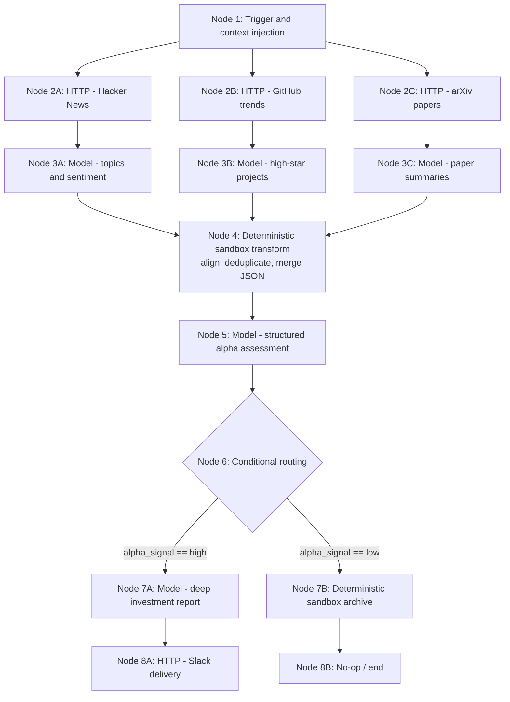

# DAGForge North-Star Workflow

This document records the end-to-end workflow that the execution kernel must
support without executor-specific logic leaking into Workflow Runtime.

The concrete Model, WASM, and MCP executors are intentionally not designed by
the durable-recovery change. They will occupy the existing `ITaskExecutor`
seam later.

## Target graph



Node 5 publishes a schema-constrained value such as:

```json
{
  "alpha_signal": "high",
  "reason": "..."
}
```

## Planned executor families

The intended product eventually includes four executor families:

1. a command/data-processing executor backed by a WASM sandbox;
2. an HTTP executor;
3. a model executor;
4. an MCP executor.

Their configuration and capability schemas are future work. Workflow Runtime
must continue to see only compiled config, typed inputs and outputs, lifecycle
signals, and `ExecutionFailure`.

## Acceptance invariants

The graph is considered supported only when all of the following hold:

- the three fetch and model branches execute concurrently and fan in exactly
  once all required inputs are available;
- a failed branch returns one structured failure hierarchy through the
  dedicated failure-report interface;
- oversized diagnostics are returned as named Artifact references and remain
  retrievable through the generic Artifact interface;
- process restart preserves successful branches and retained outputs, closes
  the interrupted Attempt as `runtime_restarted`, and creates a new Attempt
  only for unfinished work;
- a revised JSON Plan creates an immutable child Repair Run rather than
  mutating the failed parent;
- unchanged successful independent branches are reused, while a changed node
  and every dependent node are invalidated transitively;
- conditional routing uses the persisted structured output and does not
  execute the unselected branch;
- repeated start or repair requests with the same retained idempotency key
  return the authoritative existing Run ID;
- Plan, Run, Task, Attempt, failure, Artifact, lineage, and reuse provenance
  survive restart without executor-specific persistence code.

This scenario is the architectural acceptance target for later executor work.
New features should be evaluated by whether they deepen the existing seams
needed by this graph, not by whether they add another parallel control path.
